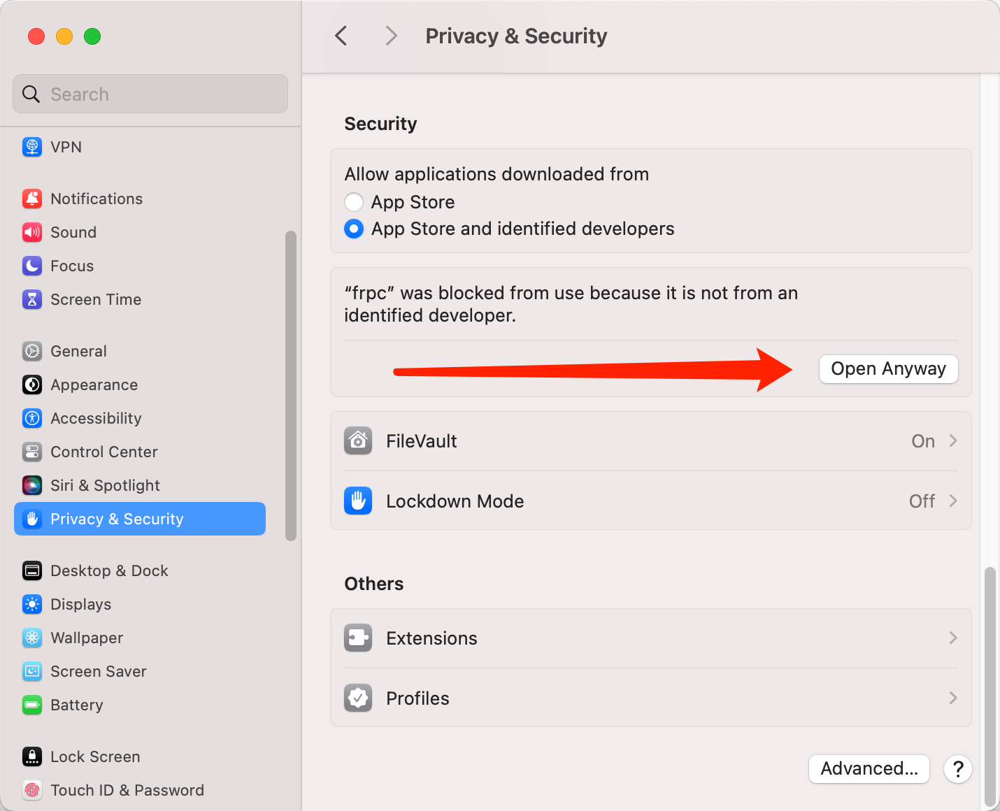

# 内网穿透服务

此服务不对外，仅限内部使用。

## 配置与启动

修改配置文件 frpc.toml

```toml
serverAddr = "frp.renfei.net"
serverPort = 7000

auth.method = "token"
# Token
auth.token = "12345678"

# 本地控制台界面
webServer.addr = "127.0.0.1"
webServer.port = 7400
webServer.user = "admin"
webServer.password = "admin"

# HTTP穿透
[[proxies]]
# 名称
name = "web01"
# 类型
type = "http"
# 本地IP
localIP = "127.0.0.1"
# 本地端口
localPort = 80
# 子域名，web01将变为web01.renfei.net
subdomain = "web01"


# 端口穿透
[[proxies]]
# 名称
name = "ssh"
# 类型
type = "tcp"
# 本地IP
localIP = "127.0.0.1"
# 本地端口
localPort = 22
# 服务器端口填写0将随机分配，手动分配请选择 9000-10000
remotePort = 0
```

### 启动服务

下载对应的平台程序，使用以下命令启动：

```bash
./frpc -c frpc.toml
```

## HTTP穿透

HTTP穿透是最常用也是最主要的方式，当成功配置启动后，你将得到一个子域名，例如：web01将变为web01.renfei.net。

如果只是你自己本机访问，你可以配置 hosts 文件，将 web01.renfei.net 映射到 frp.renfei.net 的 IP 地址即可。

但是如果这个服务需要全互联网进行访问，需要联系我配置 DNS 解析。

## 端口穿透

服务器端口 9000-10000 默认是开放状态，你可以直接使用，IP 地址填写 frp.renfei.net 即可。

## 配置成为服务

配置成系统服务后将跟随系统开机自启动。

### Linux 服务

- 复制 frpc 到 /usr/bin/frpc
- 复制 frpc.toml 到 /etc/frpc/frpc.toml
- 创建服务文件 /usr/lib/systemd/system/frpc.service 内容参见:[frpc.service](./frpc.service)
- 执行：```sudo systemctl daemon-reload```
- 启动：```sudo systemctl start frpc```
- 查看：```sudo systemctl status frpc```
- 自启：```sudo systemctl enable frpc```

## 常见问题

### MacOS 无法验证开发人员

您运行 frpc 时，可能收到提示：


- “frpc” cannot be opened because the developer cannot be verified.
  - macOS cannot verify that this app is free from malware.
- 无法打开“frpc”，因为无法验证开发人员。
  - macOS无法验证此应用程序是否没有恶意软件。

您需要在设置中允许 macOS 允许打开未识别开发者的应用程序。

隐私与安全 -> 点击Open Anyway。


